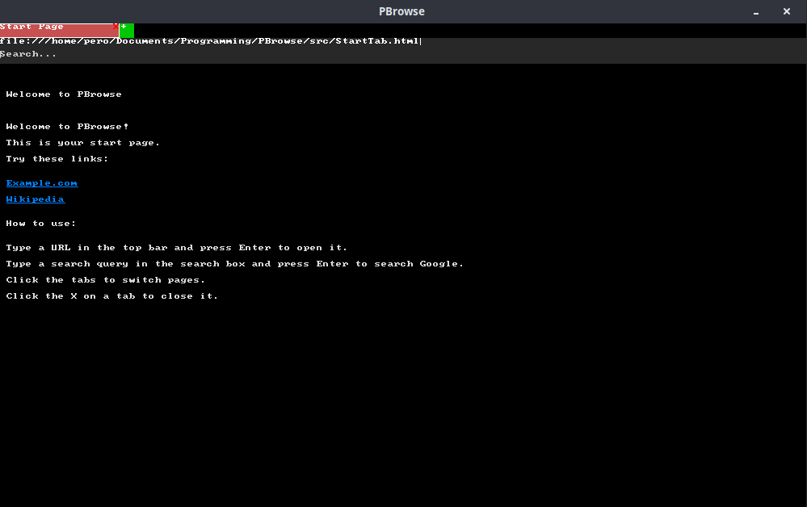

# PBrowse - Tiny Fast Browser

**PBrowse** is a **minimal graphical web browser** written in C++ using **SDL2** and optionally **libcurl**. It's designed to be **small, fast, and lightweight**. Open local HTML files or basic web pages, follow links, and navigate using keyboard or mouse—all in a single tiny SDL window.



---

## Features

* Open **local HTML files** (`file://`) or web pages (`http://` / `https://`).
* Render **basic text** with **clickable links**.
* Minimal **single-tab interface** for speed.
* Scrollable content area.
* **Tiny binary size** and low memory usage.

> Optional features for speed vs. usability:
>
> * Multiple tabs (adds memory and complexity)
> * Search bar (can be skipped to save space)
> * Full HTML parsing (only extract text + links for minimal build)

---

## Controls

* **Up / Down Arrow** – Scroll page content
* **Enter** – Load URL
* **Mouse Click** – Follow a link
* **Backspace** – Delete in URL input

Optional (if implemented):

* **+ / X buttons** – Open / close tabs

---

## Requirements

* **C++17 compatible compiler** (g++, clang++)
* **SDL2** library
* Optional: **libcurl** for HTTP/HTTPS

### Install on Ubuntu / Debian

```bash
sudo apt update
sudo apt install g++ libsdl2-dev libcurl4-openssl-dev
```

### Install on Fedora

```bash
sudo dnf install gcc-c++ SDL2-devel libcurl-devel
```

### Install on Arch

```bash
sudo pacman -S gcc sdl2 curl
```

---

## Compilation

To compile **PBrowse**:

```bash
g++ -O3 -std=c++17 src/PBrowse.cpp `pkg-config --cflags --libs sdl2` -lcurl -o PBrowse
strip PBrowse
```

* `-O3` = maximum optimization for speed
* `strip` = removes debug info → smaller binary

---

## Usage

1. Run the program:

```bash
./PBrowse
```

2. By default, it opens `src/StartTab.html`.
3. Use the **URL bar** to open a web page or local file.
4. Click links to navigate.
5. Scroll with **Up / Down arrows**.

---

## License

MIT License – free to use, modify, and distribute. Attribution required. See [LICENSE](LICENSE).
